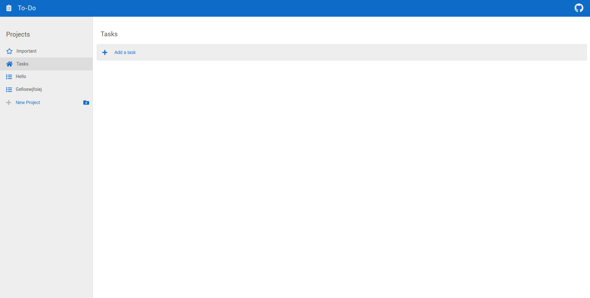

# The Odin Project: To-Do List

 

Implementation of the To-Do list project from The Odin Project [curriculum](https://www.theodinproject.com/)

The goal of this project was to create a functional To-Do page using various techniques including localStorage, webpack, modules, and factory functions.

## Built With

- Vanilla JS
- HTML5
- CSS3

## Live Demo

[To-Do List](http://gavinslim.com/todo-list/) :ballot_box_with_check:

## Setup

1. Clone the repository:<br>```git clone https://github.com/gavinslim/todo-list.git```

2. Inside the cloned repo, install the required dependencies:<br>```npm install```

3. Initiate live demo:<br>```npm run start```

4. Produce the distribution files:<br>```npm run build```

## Resources

- [Webpack](https://webpack.js.org/guides/getting-started/#using-a-configuration)
